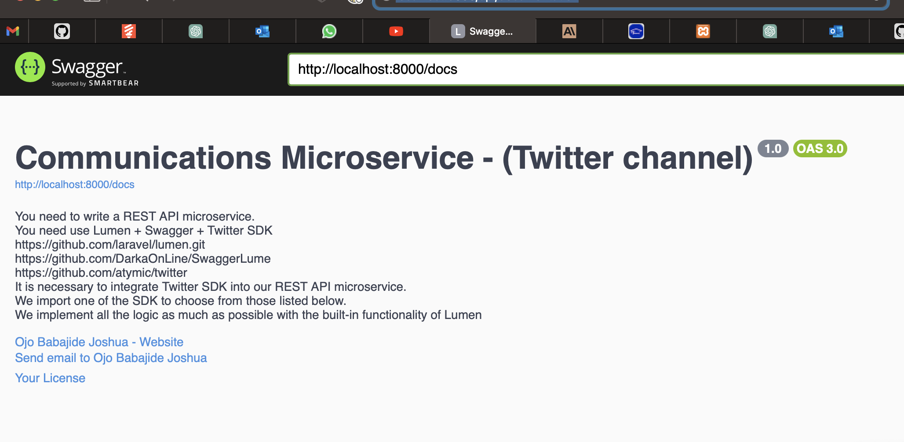

# Lumen Twitter SDK Microservice

This microservice integrates Twitter SDK into a REST API built with Lumen. It provides endpoints for subscribing users, sending messages, handling webhooks, and more.

## Project Setup

1. Clone the repository:

   ```bash
   git clone https://github.com/babajide2018/lumen-twitter-sdk.git
Install dependencies:
bash
Copy code
cd lumen-twitter-sdk
composer install
Set up your environment variables:
bash
Copy code
cp .env.example .env
Update the .env file with your configuration.
Run migrations:
bash
Copy code
php artisan migrate
Note: Database migrations are available in the database directory, (database/twitter_sdk.sql)'. If needed, you can also import the SQL file directly.
Generate Swagger documentation:
bash
Copy code
php artisan swagger-lume:generate
Access the Swagger UI at /api/documentation to explore the API.
Database Migrations


To serve the app: php -S localhost:8000 -t public



The database migrations are located in the database/migrations directory. Run the following command to apply migrations:

bash
Copy code
php artisan migrate
If you prefer using an SQL file, you can find it in the database directory.

Endpoints

1. Subscribe Users to a Chat Bot
Endpoint: /subscribe-to-chatbot
Method: POST
Request Body:
json
Copy code
{
  "user_id": "80000000-8000-8000-8000-000000000001"
}
Response:
json
Copy code
{
  "message": "User subscribed to chat bot"
}
2. Subscribe Users to a Channel or Chat
Endpoint: /subscribe-to-channel
Method: POST
Request Body:
json
Copy code
{
  "user_id": "80000000-8000-8000-8000-000000000002",
  "channel_name": "general"
}
Response:
json
Copy code
{
  "message": "User subscribed to channel"
}
<!-- Add documentation for other endpoints -->
Author

Name: Ojo Babajide Joshua (geenius@zyrocs.com)
email: ojobabajide2018@gmail.com

Feel free to customize this README according to your project's structure and add more sections as needed.